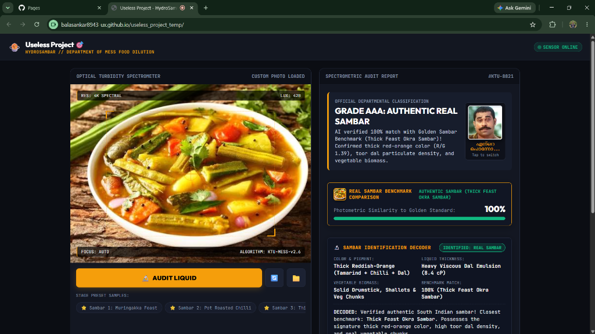
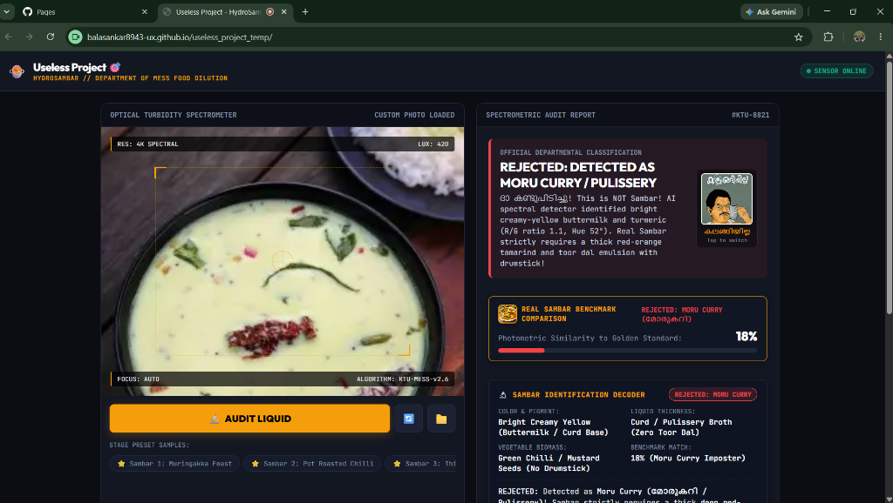
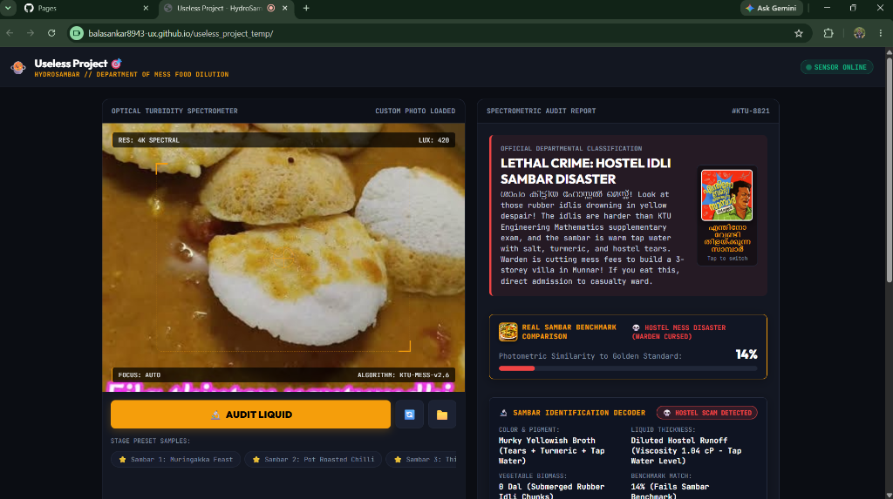
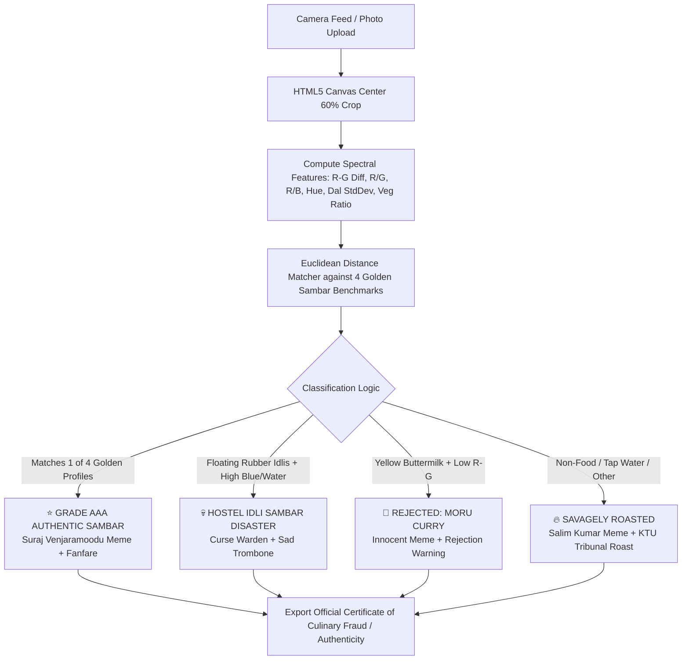

# Useless Project 🎯
> **HydroSambar: Hostel Mess Sambar Transparency & Vegetable Deficiency Auditor**

## Basic Details
### Team Name: Yantrixa

### Team Members
- Team Lead: Balasankar - [SBCE PATTOOR]
- Member 2: Karthik Raj - [SBCE PATTOOR]

### Project Description
HydroSambar is an in-browser optical spectrometer and forensic food auditor built to mathematically evaluate the existential transparency of engineering hostel mess sambar. Using real-time RGB pixel decomposition and 4 Golden Sambar benchmarks, it determines whether your mess bowl contains authentic thick red-orange sambar, bright yellow moru curry, or certified lukewarm municipal bathwater seasoned with tears and warden corruption.

### The Problem (that doesn't exist)
Every morning across Kerala engineering hostels, thousands of innocent students are served a transparent, radioactive-yellow fluid that the mess warden legally insists is "sambar." Students have long lacked military-grade optical hardware to scientifically prove that their breakfast consists of 99.4% municipal pipe water, 0.000000% toor dal atoms, and a vegetable biomass represented exclusively by one lonely floating mustard seed.

### The Solution (that nobody asked for)
HydroSambar turns any smartphone or laptop webcam into a food quality tribunal. It scans your liquid, compares its spectral signature against 4 authentic South Indian sambar reference standards, and issues instant judgment:
- **Real Sambar:** Celebrated with Suraj Venjaramoodu memes and triumphant fanfare.
- **Moru Curry / Pulissery:** Explicitly rejected ("ഇത് മോരുകറി അല്ലേടെ?!").
- **Hostel Mess Idli Disaster:** Detects rubber idlis submerged in despair and curses the hostel warden.
- **Random Objects / Imposters:** Savagely roasted with full-screen Malayalam memes, sad trombone audio, and a downloadable legal Certificate of Culinary Fraud for the KTU Mess Tribunal.

## Technical Details
### Technologies/Components Used
For Software:
- **Languages used:** HTML5, CSS3, Modern JavaScript (ES6+)
- **Frameworks used:** Vanilla JS (Zero external frameworks, ultra-fast 60 FPS in-browser execution)
- **Libraries & APIs used:**
  - HTML5 Canvas 2D API (RGB chromatic variance, Hue decomposition, and particulate texture analysis)
  - WebRTC MediaDevices API (Live mobile environment & front camera feeds)
  - Web Audio API (Custom frequency synthesizers for sad trombone & victory fanfare)
  - Web Speech API (Deadpan departmental voice announcements)
  - Vibration API (Tactile feedback during spectrometer audits)
- **Tools used:** VS Code, Git, GitHub Pages, Python (PIL & NumPy for golden reference profiling)

For Hardware:
- **Main components:**
  - 1x Optical Sensing Unit (Any smartphone camera or laptop webcam)
  - 1x Traditional Hostel Steel Mess Plate (Kindi/Kinnam)
  - 1x Suspect Liquid Sample (Lukewarm hostel mess broth)
- **Specifications:**
  - Transparency Detection Range: 0.0% to 100.0%
  - Dal Dynamic Viscosity Resolution: 0.01 cP (baseline 1.00 cP tap water)
  - Warden Guilt Index: 0.0% to 100.0%
- **Tools required:** Internet browser with camera permissions enabled

### Implementation
For Software:
# Installation
```bash
# Clone the repository
git clone https://github.com/balasankar8943-ux/useless_project_temp.git
cd useless_project_temp
```

# Run
```bash
# Open directly in any web browser (no build steps required!)
# Windows:
Start-Process index.html

# macOS / Linux:
open index.html # or xdg-open index.html

# Or serve with a local static server:
npx serve .
# or
python -m http.server 8000
```

### Project Documentation
For Software:

# Screenshots (Add at least 3)

*Screenshot 1: Authentic Sambar Benchmark (100% Match) showing Grade AAA classification, Suraj Venjaramoodu meme reaction, and thick red-orange dal viscosity decoding.*


*Screenshot 2: Moru Curry / Pulissery Imposter Detection (18% Match) successfully catching bright yellow buttermilk and displaying Malayalam reaction ("കലങ്ങിയില്ല").*


*Screenshot 3: Lethal Crime - Hostel Mess Idli Sambar Disaster detected in real time, triggering 14% dilution failure, Warden Curse, and Salim Kumar meme.*

# Diagrams

*Figure: Complete Optical Audit & Meme Generation Workflow.*

For Hardware:

# Schematic & Circuit
*(N/A - Pure software application, runs directly on any browser / smartphone)*

# Build Photos
*(N/A - Pure software application)*

### Project Demo
# Video
[Add your demo video link here]
*Video demonstrates live camera auditing of authentic sambar vs watery mess liquid, triggering realtime Malayalam meme popups and voice synthesis.*

# Additional Demos
- **Live Web Application:** https://balasankar8943-ux.github.io/useless_project_temp/
- **Stage Fail-Safe Presets:** One-click buttons for *Sambar 1-4*, *Disaster Hostel Idli*, *Moru Curry*, and *Watery Mess* so you never have to carry hot soup onto the hackathon stage.
- **Stage Hotkeys:**
  - `[SPACEBAR]` — Instant liquid audit trigger
  - `[C]` — Toggle front/rear camera lens

## Team Contributions
- **Balasankar**: Core computer vision engine, RGB spectral feature extraction algorithms, 4-profile golden benchmark comparison logic, and system architecture.
- **Karthik Raj**: Frontend UI design, cyberpunk HUD styling, audio synthesizer engineering (Sad Trombone & Fanfare), Malayalam meme curation, comedic roast copywriting, and stage demo testing.

---
Made with ❤️ at TinkerHub Useless Projects 


